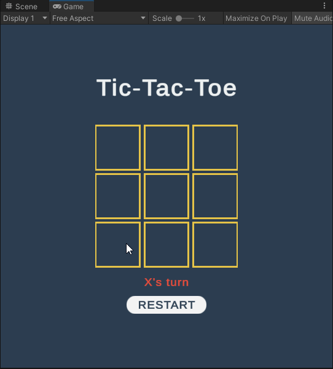

# Tic-Tac-Toe game

*A game developed for a test assignment.*

## Requirements
- Implement a Tic-Tac-Toe game using [Unity](https://unity.com/).
- Game logic must be implemented separately.
- Use [Extenject](https://github.com/Mathijs-Bakker/Extenject) framework for dependency injection.
- All dependencies in the project must be injected using the DI framework.

## Gameplay demonstration

